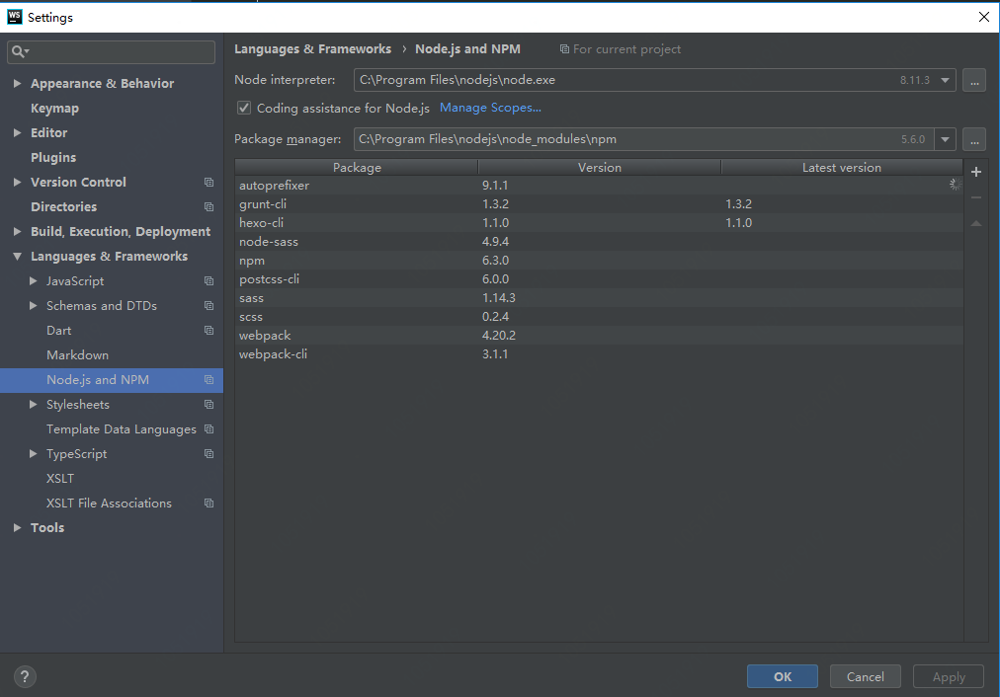

    在日常开发中，时常会碰到各种各样的坑，本文总结了开发过程中碰到的常见问题。

----------

## WS ##
### css 预编译配置
以 scss 为例：

```
npm install sass -g
```
<!-- more -->
在 Setting -> Tools -> File Watchers 进行如下配置：<br>
1. Program：C:\Users\yuce\AppData\Roaming\npm\sass.cmd
2. Arguments：$FileName$:$FileNameWithoutExtension$.css
3. Output：$FileNameWithoutExtension$.css:$FileNameWithoutExtension$.css.map

sourcemap: 在生产环境中，以 scss 为例，我希望看到的未经编译文件的调试信息，而非编译后的，这样会方便开发人员调试，快速定位问题，生成的 source map,  同时需要在 chrome 中开启才能生效。

--------------

### nodejs 环境配置
打开 setting 搜索 node.js 
配置 Node interpreter
勾选 code assistance for node.js

<div align=center>

最后重启 ws 即可。

----------------

### WS 优化
#### exclude项目中不用的文件
进入Settings->Project->Directories，把用不到的文件目录都Excluded（选中该文件目录，右击鼠标，点Excluded）
进入Settings->Editor->File Types，在最下面的Ignore files and folders中加入要ignore的文件或文件夹
在project窗口的文件夹上，右击鼠标，点击Mark Directory As->Excluded

#### 优化代码检查
进入Settings->Editor->Inspections，把用不到的检查都关掉
进入Settings->Editor->General，把最下面的Error highlighting->Autoreparse delay(ms) 改成比较大的值（如20000)

#### 去掉平时用不到的插件
进入Settings->Plugins，去掉平常用不到的插件，在一定程度上会提高软件打开时的加载速度。

#### 优化typescript编译
进入Settings->Languages & Frameworks->Typescript，取消Track changes

#### 优化文件保存
可以取消自动保存功能（建议保留该功能！）：

进入Settings->Apparence & Behavior->Synchronization，取消 Synchronize file on frame deactivation 和 Save files automatically 的选择。

#### 清除缓存
项目久了之后可以清除缓存：点击File -> Invalidate Caches / Restart

----------------

### 常用快捷键
ctrl + shift + n: 打开工程中的文件，目的是打开当前工程下任意目录的文件。
ctrl + j: 输出模板
ctrl + b: 跳到变量申明处
ctrl + alt + T: 围绕包裹代码(包括zencoding的Wrap with Abbreviation)
ctrl + []: 匹配 {}[]
ctrl + F12: 可以显示当前文件的结构
ctrl + x: 剪切(删除)行，不选中，直接剪切整个行，如果选中部分内容则剪切选中的内容
alt + left/right:标签切换
ctrl + r: 替换
ctrl + shift + up: 行移动
shift + alt + up: 块移动(if(){},while(){}语句块的移动)
ctrl + d: 行复制
ctrl + shift + ]/[: 选中块代码
ctrl + / : 单行注释
ctrl + shift + / : 块注释
ctrl + shift + i : 显示当前CSS选择器或者JS函数的详细信息
ctrl + '-/+': 可以折叠项目中的任何代码块，它不是选中折叠，而是自动识别折叠。
ctrl + '.': 折叠选中的代码的代码。
ctrl+/ 单行注释
ctrl+shift+/块注释
ctrl+shift+ +/-展开/折叠
ctrl+alt+L 格式化代码
ctrl+shift+ up/down 上下移动句子
Alt+回车 导入包,自动修正
Ctrl+N 查找类
Ctrl+Shift+N 查找文件
Ctrl+Alt+L 格式化代码
Ctrl+Alt+O 优化导入的类和包
Alt+Insert 生成代码(如get,set方法,构造函数等)
Ctrl+E或者Alt+Shift+C 最近更改的代码
Ctrl+R 替换文本
Ctrl+F 查找文本
Ctrl+Shift+Space 自动补全代码
Ctrl+空格 代码提示
Ctrl+Alt+Space 类名或接口名提示
Ctrl+P 方法参数提示
Ctrl+Shift+Alt+N 查找类中的方法或变量
Alt+Shift+C 对比最近修改的代码
Shift+F6 重构-重命名
Ctrl+Shift+先上键
Ctrl+X 删除行
Ctrl+D 复制行
Ctrl+/ 或 Ctrl+Shift+/ 注释（// 或者/*...*/ ）
Ctrl+J 自动代码
Ctrl+E 最近打开的文件
Ctrl+H 显示类结构图
Ctrl+Q 显示注释文档
Alt+F1 查找代码所在位置
Alt+1 快速打开或隐藏工程面板
Ctrl+Alt+ left/right 返回至上次浏览的位置
Alt+ left/right 切换代码视图
Alt+ Up/Down 在方法间快速移动定位
Ctrl+Shift+Up/Down 代码向上/下移动。
F2 或Shift+F2 高亮错误或警告快速定位
代码标签输入完成后，按Tab，生成代码。
选中文本，按Ctrl+Shift+F7 ，高亮显示所有该文本，按Esc高亮消失。
Ctrl+W 选中代码，连续按会有其他效果
选中文本，按Alt+F3 ，逐个往下查找相同文本，并高亮显示。
Ctrl+Up/Down 光标跳转到第一行或最后一行下
Ctrl+B 快速打开光标处的类或方法